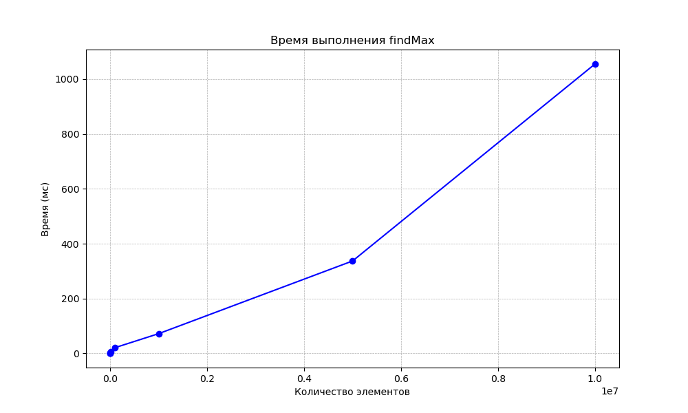

  
## Функции
 Реализована простейшая программа на Java, которая выполняет следующие функции: 
 1. Читает числа из файла. 
 2. Ищет минимальное число. 
 3. Ищет максимальное число .
 4. Считает сумму всех чисел.
 5. Считает произведение всех чисел. 
 
## Подготовлены тесты:
 - Проверяющие корректность работы функций поиска минимума и максимума.
  - Проверяющие корректность работы функций сложения и умножения.
  - Проверяющие скорость работы программы при увеличении размера входного файла (при увеличении количества чисел в файле).

 ## Как запускать проект  
 Проект требует *Java 17*
 - Для сборки проекта используйте следующую команду Maven: ` mvn clean install `
 - Для запуска тестов - `mvn test`,  либо запустить вручную Action через `Run workflow`
  
## 

На данном графике представлена зависимость времени выполнения функции `findMax` от количества чисел в файле.

C увереностью можно сказать, что зависимость **линейная**

Функция `findMax` реализована с помощью простого линейного поиска максимального элемента в массиве. 
Она последовательно проходит по всем элементам массива и сравнивает каждый элемент с текущим максимальным значением, обновляя его при необходимости. Этот алгоритм требует времени, пропорционального количеству элементов в массиве, что объясняет линейную зависимость времени выполнения от размера массива, 
